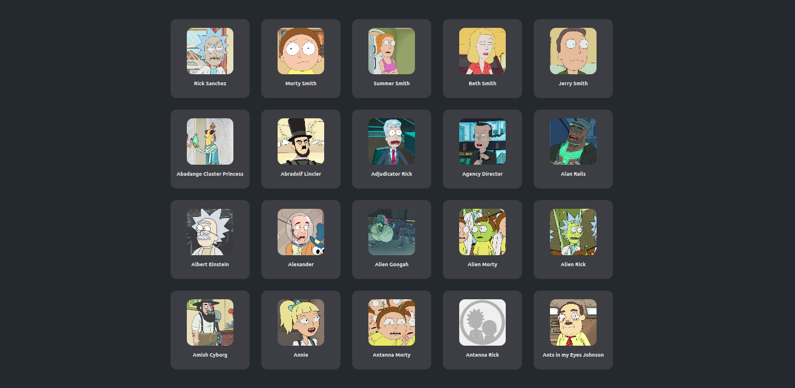

# day-29-in-30-days-of-react 

- in this project i did something simple but interesting, to prevent the page from loading and running out of items to display while sending a request to the api, i created one, very simple, loading page

# result image  

